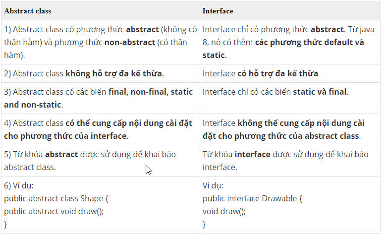
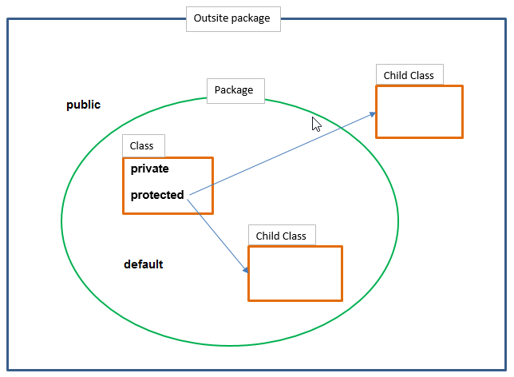
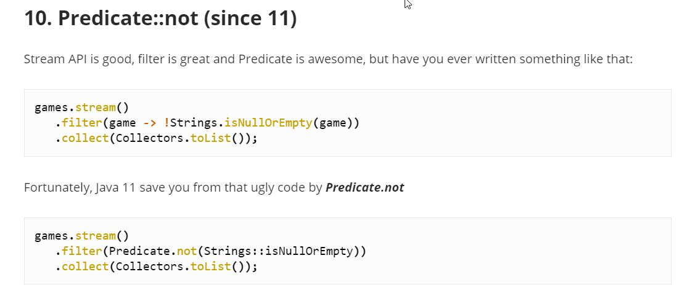

### sự khác nhau và cách sử dụng interface và abstract class

* `Interface` : Khi bạn muốn tạo dựng một bộ khung chuẩn gồm các chức năng mà những module hay project cần phải có. Giống
  như sau khi nhận requirement của khách hàng về team ngồi với nhau và phân tích các đầu mục các tính năng của từng
  module, sau đó triển khai vào code viết các interface như đã phân tích,để các bạn dev có thể nhìn vào đó để thực hiện
  đủ các tính năng (khi đã implement rồi thì không sót một tính năng nào ^^).
* `Abstract class`: Giống như demo trên bạn có thể hiểu khi định nghĩa một đối tượng có những chức năng A,B,C trong đó
  tính năng A,B chắc chắn sẽ thực thi theo cách nào đó, còn tính năng C phải tùy thuộc vào đối tượng cụ thể là gì, như
  đối tượng Dog, Cat tuy chúng đều có thể phát ra âm thanh nhưng âm thanh là khác nhau. Vì vậy method Speak() là
  abstract method để chỉ ra rằng tính năng này còn dang dở chưa rõ thực thi, các lớp extend phải hoàn thành nốt tính
  năng này, còn những tính năng đã hoàn thành vẫn sử dụng như bình thường đây là những tính năng chung.

### some tips

* 1 class khi implement 1 interface hoặc extends 1 abstract class thì sẽ PHẢI triển khai hết các abstract method

* `Concrete class`: là 1 lớp cụ thể, các method của nó luôn được định nghĩa tất cả, kể cả implement interface và extends abstract class cũng phải thể hiện hết
* `static Method`: cấu trúc của lớp con vẫn phải giống lớp cha nhưng lại không thực hiện kế thừa (cha gọi cha, con gọi con)

* Phạm vi truy cập `method của class con` phải luôn lớn hơn hoặc bằng `method của class cha`

* `FunctionalInterface`: là 1 dạng tạo function nhanh tự custom fuction xử lý và trả về giá trị được định nghĩa ở trong interface

* `Immutable class` là 1 class sẽ không thay đổi các thuộc tính của nó từ lúc khởi tạo xong cho đến lúc kết thúc vòng đời
  của nó hay nói cách khác là sẽ chỉ khởi tạo thuộc tính của nó 1 lần ở contructor

* khối `synchronized(obj)` sẽ khóa với lớp hiện tại 
  > obj không bị thay đổi trong các luồng thì khối sẽ không lock chờ nhau

* Arrays.asList: mutable list  
  List.of: immutable list

