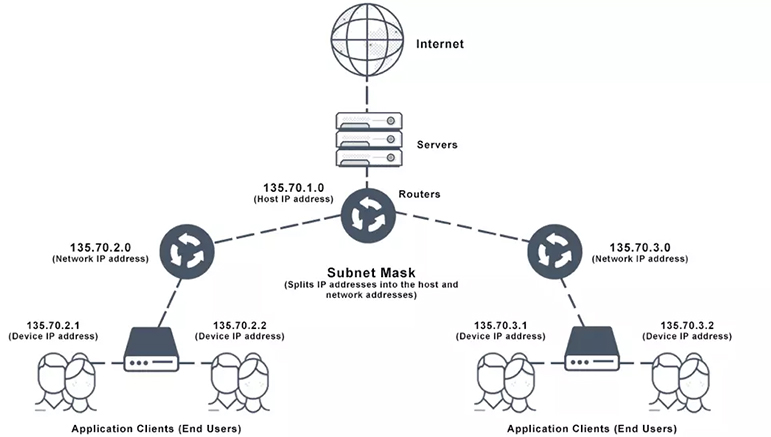
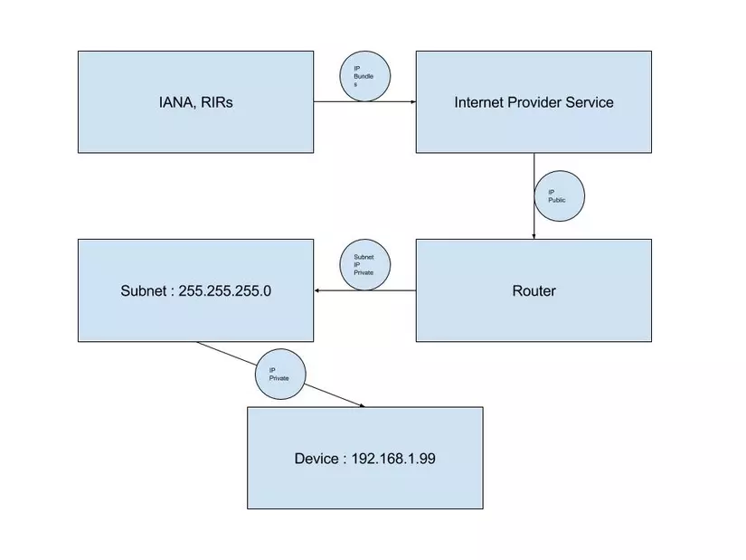

# IP

## Concept

* là một dãy nhị phân dài 32 bit. có dạng kiểu:
  > `10000000 00101010 00000101 00000100`  
  > Mỗi một dãy 8 bit kia gọi là octet

* cấu trúc gồm 2 phần:
  - network: chính là địa chỉ cho chính network đó
  - host: dùng để đánh cho cách thiết bị mạng ở trong network đó

* IP Address được quản lý bởi IANA và RIRs. Các tổ chức này chịu trách nhiệm phân phối các IP Address tới các nhà cung
  cấp Internet. Đó còn được gọi là các `Public IP Address`
* `Private IP Address`: là địa chỉ IP được các nhà cung cấp dịch vụ hoặc admin của hệ thống chỉ định cho các thiết bị client

  - `10.0.0.0 – 10.255.255.255` (Có tổng cộng 16,777,216 địa chỉ)
  - `172.16.0.0 – 172.31.255.255` (Có tổng cộng 1,048,576 địa chỉ)
  - `192.168.0.0 – 192.168.255.255` (Có tổng cộng 65,536 địa chỉ)

## Loopback IP 127.0.0.1

* 127.0.0.1 là 1 Reserved IP Address và ý nghĩa của địa chỉ này là chính host device đang gửi gói tin.
* Chúng ta có thể sử dụng địa chỉ này cho các mục đích test nhờ vào tính tách biệt của nó với hệ thống mạng
* Được biểu diễn dưới dạng:
  > 127.0.0.0/8 -> `127.0.0.0 – 127.255.255.255` 
  > vậy nên 127.0.0.1 không phải địa chỉ loopback duy nhất 

* Tất cả các gói tin được gửi tới loopback address sẽ không được gửi tới NAT như các `private address`.
* Ngay từ phần cứng của thiết bị mạng đã ngăn chặn điều này rồi, chip NIC trên card mạng thậm chí không nhận ra sự có
  mặt của các gói tin này
* Các gói tin loopback được phân tách dựa vào địa chỉ IP mà nó được chỉ định truyền tới, điều đó nghĩa là các HTTP
  service có thể truyền gói tin từ loopback address này sang loopback address khác như bình thường:
  > 127.0.0.99:80 => 127.0.0.100:80
* Các gói tin được nhận ở 1 địa chỉ không phải loop-back mà có source hoặc destination address lại là loopback address
  thì sẽ bị drop và không thể thực hiện

# Subnet

## Concept

* Subnet là một số dạng 32 bit

    > VD: 11111111  11111111  11110000  00000000

* Subnet mask: là dãy số có `host bit dưới dạng số 0` và `network bit dạng số 1`
* Địa chỉ mạng thường là 0 và broadcast thường là 255

  > mục tiêu chính của subnet mask đó là kích hoạt quá trình subnetting. Trong đó, subnet mask sẽ có tác dụng che địa
  > chỉ IP của bạn dưới dạng các số 32 bit. Đây cũng là lý do vì sao Subnet Mask có từ “mask” – mặt nạ ở trong tên gọi.

* Class A: 255.0.0.0 -> thể hiện phần mạng đầu tiên, chia các host thành các octet 2,3,4 khi cần
* Class B: 255.255.0.0 -> tương tự
* Class C: 255.255.255.0 -> tương tự

> `Subnet mask` sẽ phân chia địa chỉ IP. `Subnet mask` hoạt động thông qua việc hạn chế phạm vi hoạt động, giúp hạn chế,
> giảm thiểu tối đa tình trạng tắc nghẽn mạng khi sử dụng đồng thời nhiều thiết bị. 

## cách chia

- ví dụ : 
  + ip: `192.168.2.10`
  + subnet mask: `255.255.255.0`
- dãy nhị phân: 
  + ip:          `11000000 10101000 00000010 00001010`
  + subnet mask: `11111111 11111111 11111111 00000000`
  + đếm tất cả các bit 1 của subnet mask ta có số prefix là 24, tức là 24 bit đầu được đánh địa chỉ cho network(`192.168.2.0`)
  + còn 32-24 = 8 bit để đánh địa chỉ cho các host ở trong network đó
- dùng phép toán and để tính
  + ta được dãy `11000000 10101000 00000010 00000000` -> `192.168.2.0`
- nếu ta muốn chia làm 3 subnet ta sẽ phải mượn thêm 2 bit của host
  + `11000000 10101000 00000010 00000000` -> `192.168.2.0`   -> `192.168.2.1` ~ `192.168.2.62`
  + `11000000 10101000 00000010 01000000` -> `192.168.2.64`  -> `192.168.2.65` ~ `192.168.2.126`
  + `11000000 10101000 00000010 10000000` -> `192.168.2.128` -> `192.168.2.129` ~ `192.168.2.191`
  + `11000000 10101000 00000010 11000000` -> `192.168.2.192` -> `192.168.2.193` ~ `192.168.2.254`
- ta có 26 bit để đánh địa chỉ mạng rồi -> còn 32-26=6 bit để đánh cho các host
  + Công thức tính số host sẽ là: 2^6 - 2 = 62. cho mỗi subnet

- vậy với `10.0.200.0/21` thì ta có 21 bit đầu để đánh địa chỉ cho network còn 11 bit để đánh cho các host trong network
  > => số host khả dụng sẽ là 2^11 = 2048 và trừ đi các địa chỉ đầu đít cho các thứ khác

## ý nghĩa của network prefix (CIDR)

  > Dữ liệu sẽ được luân chuyển thông qua router ( hay Default Gateway Address ) đến thiết bị đích nếu như Network Prefix
  > khác nhau, nếu các Prefix giống nhau, các gói tin sẽ được gửi 1 cách trực tiếp.  
  > VD: 10.--.--.--/24 -> 24 là network prefix

# Mac Address

* là địa chỉ vật lý _cố định_ của các thiết bị được sử dụng để truyền trực tiếp các gói tin trong mạng local

# NAT - Network Address Translation

* Router sẽ nhận được 1 `public ip` của nhà cung cấp
* Các device kết nối và router sẽ được DHCP phát cho 1 `private ip`

## Default gateway

* là địa 1 địa chỉ trong mạng LAN do router cung cấp
* nó sẽ map với public ip của router
* khi có 1 ip muốn ra ngoài, thì nó sẽ gửi yêu cầu đến default gateway rồi DG sẽ kiểm tra địa chỉ đích trong yêu cầu và
  quyết định gửi yêu cầu đến đâu để đáp ứng yêu cầu của ip đó

NAT vẫn được sử dụng khi bạn kết nối vào VPN, nhưng chỉ để kết nối giữa địa chỉ IP của điện thoại của bạn và địa chỉ IP
của máy chủ VPN. Sau khi kết nối thành công, dữ liệu sẽ được truyền qua kết nối VPN trực tiếp giữa điện thoại của bạn và
máy chủ VPN, và không cần thông qua NAT nữa.