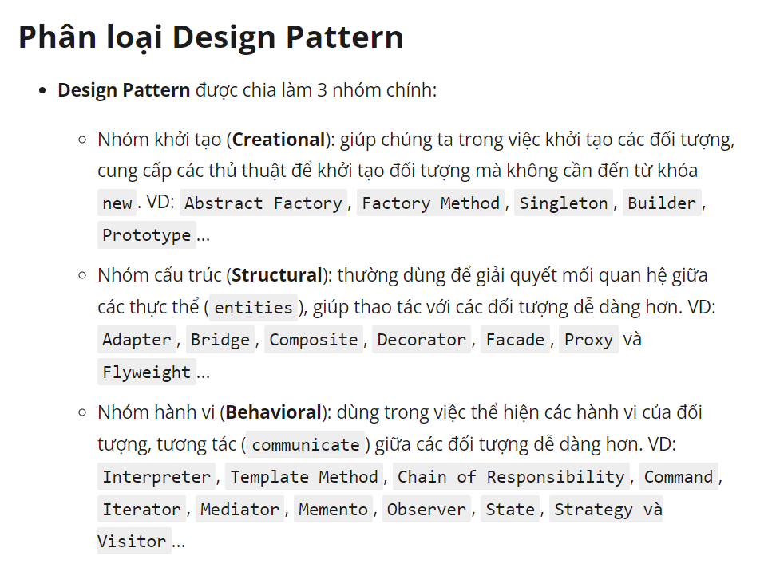

### CONCEPT

- là một giải pháp chung để giải quyết các vấn đề phổ biến khi thiết kế phần mềm trong lập trình hướng
đối tượng OOP.

- là 1 kỹ thuật code OOP

### TIPS
* `Tight Coupling`:  ám chỉ việc mối quan hệ giữa các class quá chặt chẽ. Khi thay đổi logic hay một class bị lỗi sẽ dẫn
  tới ảnh hưởng class khác, giảm tính linh hoạt và khả năng tái sử dụng của mã
* `Loose Coupling`: ám chỉ việc làm giảm bớt sự phụ thuộc giữa các class với nhau

> Sử dụng DIP và IoC cùng nhau để đạt được Loose Coupling