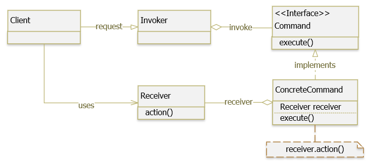

## CONCEPT

- Thuộc nhóm Behavioral
- Cho phép chuyển yêu cầu thành đối tượng độc lập, có thể được sử dụng để tham số hóa các đối tượng với các yêu cầu khác
  nhau như log, queue (undo/redo), transtraction.
- Cho phép tất cả những `Request` gửi đến object được lưu trữ trong chính object đó dưới dạng một object `Command`
- Khái niệm `Command Object` giống như một class trung gian được tạo ra để lưu trữ các câu lệnh và trạng thái của object tại một thời điểm nào đó.

> - `Command` dịch ra nghĩa là ra lệnh. `Commander` nghĩa là chỉ huy, người này không làm mà chỉ ra lệnh cho người khác làm.
> Như vậy, phải có người nhận lệnh và thi hành lệnh. Người ra lệnh cần cung cấp một class đóng gói những mệnh lệnh.
> Người nhận mệnh lệnh cần phân biệt những interface nào để thực hiện đúng mệnh lệnh. 
> - Mỗi yêu cầu (thực hiện một thao tác nào đó) được bao bọc thành một đối tượng. Các yêu cầu sẽ được lưu trữ và gởi đi
> như các đối tượng.

## PURPOSE

## ARCHITECTURE

- `Command` : là một interface hoặc abstract class, chứa một phương thức trừu tượng thực thi (execute) một hành động (
  operation). Request sẽ được đóng gói dưới dạng Command.
- `ConcreteCommand` : là các implementation của Command. Định nghĩa một sự gắn kết giữa một đối tượng Receiver và một
  hành động. Thực thi execute() bằng việc gọi operation đang hoãn trên Receiver. Mỗi một ConcreteCommand sẽ phục vụ cho
  một case request riêng.
- `Client` : tiếp nhận request từ phía người dùng, đóng gói request thành ConcreteCommand thích hợp và thiết lập
  receiver của nó.
- `Invoker` : tiếp nhận ConcreteCommand từ Client và gọi execute() của ConcreteCommand để thực thi request.
- `Receiver` : đây là thành phần thực sự xử lý business logic cho case request. Trong phương execute() của
  ConcreteCommand chúng ta sẽ gọi method thích hợp trong Receiver.

> `Client` và `Invoker` sẽ thực hiện việc tiếp nhận request. Còn việc thực thi request sẽ do `Command`, `ConcreteCommand` và `Receiver` đảm nhận.

## BENEFIT

### PROS

- Tuân thủ OCP: dễ thêm mới command mà không làm thay đổi cấu trúc ban đầu
- Giảm kết nối giữa `Invoker` và `Receiver`
- Cho phép lưu các yêu cầu trong hàng đợi.

### CONS

## USE WHEN

- Khi cần tham số hóa các đối tượng theo một hành động thực hiện.
- Khi cần tạo và thực thi các yêu cầu vào các thời điểm khác nhau.
- Khi cần hỗ trợ tính năng undo, log , callback hoặc transaction.
