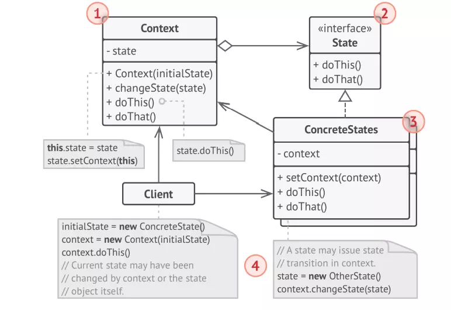
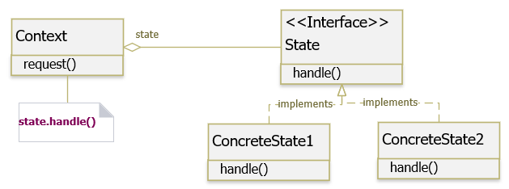

## CONCEPT

- Thuộc nhóm Behavior
- Cho phép một object thay đổi hành vi của nó khi trạng thái bên trong của nó thay đổi.
- Tạo các class mới cho tất cả các trạng thái có thể có của một object và cho tất cả các hành vi dành riêng cho
  trạng thái vào các class đó.

## PURPOSE

## ARCHITECTURE

- `Context`: Là lớp có nhiều trạng thái, hành vi lớp sẽ bị thay đổi bởi trạng thái. Được sử dụng bởi Client. Client không
truy cập trực tiếp đến State của Object. Lớp Context này chứa thông tin của ConcreteState object, cho hành vi nào tương
ứng với trạng thái nào hiện đang được thực hiện

- `State Interface`: Là interface hoặc abstract class xác định các đặc tính cơ bản của tất cả ConcreteState Object. Chúng sẽ
được sử dụng bởi đối tượng Context để truy cập chức năng có thể thay đổi.

- `Concrete States`: Là lớp cụ thể của state ứng với từng trạng thái của context

- `Cả Context và ConcreteState` đều có thể thiết lập trạng thái tiếp theo của ngữ cảnh và thực hiện chuyển đổi trạng thái
thực tế bằng cách thay thế đối tượng trạng thái được liên kết với ngữ cảnh.

- Mỗi State nên được xác định độc lập.

## BENEFIT

### PROS

- Đảm bảo nguyên tắc Single responsibility principle (SRP) : tách biệt mỗi State tương ứng với 1 class riêng biệt.
- Đảm bảo nguyên tắc Open/Closed Principle (OCP) : chúng ta có thể thêm một State mới mà không ảnh hưởng đến State khác hay Context hiện có.
- Giữ hành vi cụ thể tương ứng với trạng thái.
- Giúp chuyển trạng thái một cách rõ ràng.

### CONS

- Khi các hành vi và chức năng thay đổi quá nhiều, sẽ tốn rất nhiều công sức để cài đặt hết trường hợp hành vi
  thay đổi.
- Điểm yếu lớn nhất của State Machine dựa trên các điều kiện tự bộc lộ khi chúng ta bắt đầu thêm nhiều State và các
  state-dependent behavior vào lớp Document.
- Project càng lớn càng khó kiểm soát

## USE WHEN

- Khi hành vi của đối tượng phụ thuộc vào trạng thái của nó và nó phải có khả năng thay đổi hành vi của nó lúc run-time
  theo trạng thái mới.
- Khi nhiều điều kiện phức tạp buộc đối tượng phụ thuộc vào trạng thái của nó.