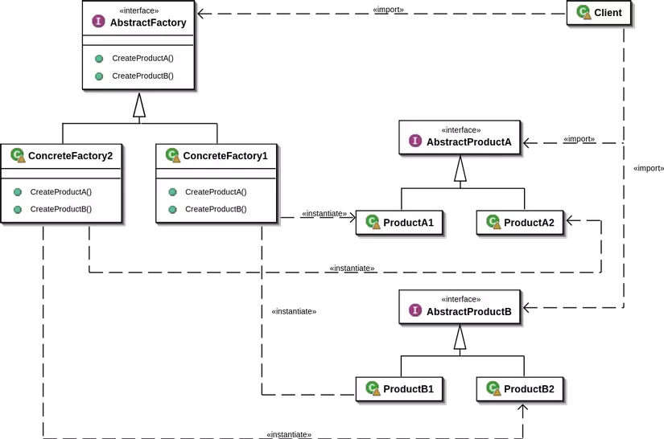

## CONCEPT

- Thuộc nhóm Creational
- Tạo ra các factory là class con của nó và các factory này được tạo ra giống như cách mà factory tạo ra các sub-class.
- Tách việc tạo ra các đối tượng với việc sử dụng chúng, mang lại tính linh hoạt và mềm dẻo hơn cho mã nguồn.

## PURPOSE

- Các product nhận được từ 1 factory sẽ tương thích với nhau
- Hạn chế phụ thuộc creator và concrete product
- Logic tạo ra các đối tượng (factories) được tách biệt khỏi logic sử dụng các đối tượng đó.

## ARCHITECTURE

- `Abstract Factory` (Factory trừu tượng):
Đây là giao diện trừu tượng dùng để tạo ra các product. Nó không thực hiện logic tạo ra product mà để lại cho
      các concrete factory.

- `Concrete Factories` (Factories cụ thể):
Đây là các lớp cụ thể triển khai giao diện abstract factory. Chúng thực hiện logic tạo ra các product tương ứng.

- `Abstract Products` (Product trừu tượng):
Đây là các giao diện trừu tượng mô tả các product. Chúng sẽ được tạo ra bởi các concrete factories.

- `Concrete Products` (Products cụ thể): 
Là các lớp cụ thể triển khai giao diện abstract products. Chúng là các đối tượng thực sự mà factories sẽ tạo ra.

- `Client`: Là lớp sử dụng abstract factory để tạo ra các products cần thiết. Client không phụ thuộc trực tiếp vào concrete
  factories và products.

- cần có 1 `interface factory` mô tả về thuộc tính của các loại của sản phẩm
- sau đó các `concrete factory` sẽ triển khai `interface factory` đó với `từng` đặc tả riêng của sản phẩm
- nhiều `abstract class` hoặc `interface` mô tả `các` loại sản phẩm chung và các `concrete class` triển khai lại

## BENEFIT

### PROS

- Có thể đảm bảo các concrete product sẽ luôn tương thích với nhau
- Tránh ràng buộc giữa client và concrete product
- Tuân theo OCP: có thể tạo ra product mà không cần sửa code client hiện có
- Tuân theo RSP: nguyên tắc đơn trách nhiệm > tạo product ở 1 nơi khác

### CONS

- Phức tạp hơn bình thường

## USE WHEN

- Các đối tượng trong 1 gia đình có các interface tương tự nhau nhưng thực hiện các logic khác nhau.
- Các đối tượng cần phải được tạo ra như một tập hợp để có thể tương thích với nhau.
- Có nhu cầu mở rộng thêm nhiều loại đối tượng mới mà không ảnh hưởng đến code cũ.

## EXAMPLE
- Có các họ lớp của sản phẩm như Windows, MacOS. Bạn muốn tạo ra các đối tượng liên quan đến giao diện người dùng như
  nút, thanh cuộn... một cách độc lập với hệ điều hành mà không làm ảnh hưởng đến các lớp khác trong chương trình.
- Có nhiều thuộc tính của sản phẩm như giá rẻ, trung bình, cao cấp. Bạn muốn tạo ra các sản phẩm có chất lượng khác nhau
  nhưng không muốn xác định cụ thể trong mã nguồn.