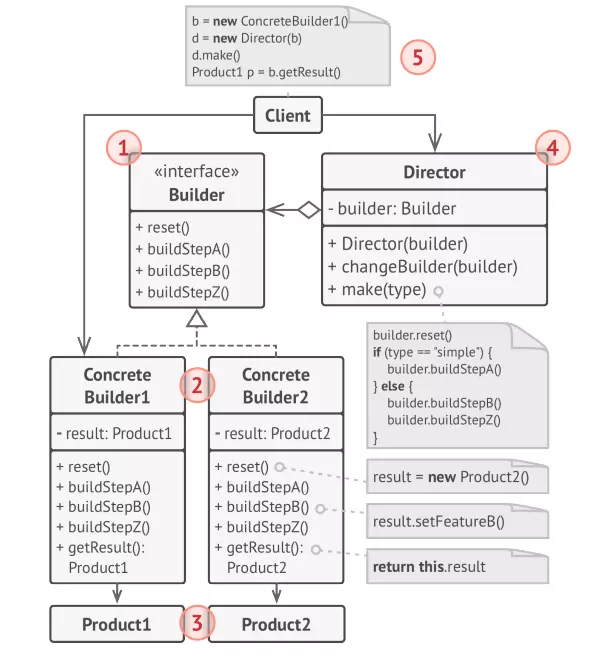
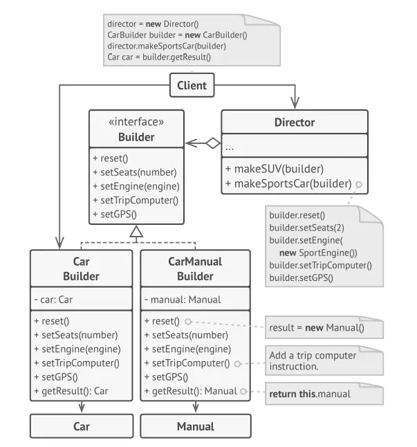

## CONCEPT

- Thuộc nhóm Creational
- Sắp xếp việc xây dự object thành tập hợp các bước
- Thực hiện các bước trên 1 `builder object`
- Không cần phải gọi tất cả các bước mà chỉ cần các bước cần thiết để tạo object

## PURPOSE

- Thay đổi thiết kế cho việc lồng nhau của các hàm khởi tạo
- Tạo ra 1 đối tượng phức tạp, đối tượng mà thuật toán để tạo lập các thuộc tính là độc lập với các thuộc tính khác
- Tránh việc tạo 1 class có nhiều constructor rối rắm

## ARCHITECTURE

- `Builder`: là 1 thành phần trừu tượng để tạo ra 1 hoặc nhiều phần đối tượng của `product`
- `ConcreateBuilder`: là thành phần triển khai, cụ thể hóa các lớp trừu tượng cho để tạo ra các thành phần và tập hợp
  các thành phần đó với nhau.
- `Product`: là thành phần cần tạo
- `Director`: thành phần khởi tạo đối tượng `Builder`

## BENEFIT

### PROS

- Có thể xây dựng đối tượng theo từng bước, trì hoãn các bước xây dựng
- Có thể sử dụng lại cùng 1 construction code để xây dựng các instance khác nhau của product
- Tuân thủ RSP tách tạo đối tượng ra khỏi business layer

### CONS

- Độ phức tạp tổng thể tăng
- Mỗi ConcreteBuilder sẽ chỉ tạo cho từng loại product
