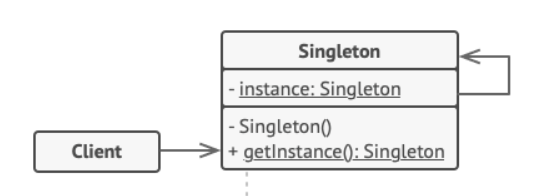

## CONCEPT

- Thuộc nhóm Creational
- Cung cấp 1 instance duy nhất được khởi tạo trong lúc runtime

## PURPOSE

- Đảm bảo chắc chắn rằng một lớp chỉ có một instance
- Có khả năng truy cập đến instance từ mọi nơi (global access)
- Đối tượng singleton chỉ được khởi tạo duy nhất một lần khi nó được yêu cầu lần đầu.

## ARCHITECTURE

## BENEFIT

### PROS

- Quản lý truy cập tốt hơn

### CONS

- vi phạm single responsibility principle
- các đối tượng biết quá nhiều về nhau -> không có tính đóng gói

## USE WHEN

- Thường được dùng cho các trường hợp giải quyết các bài toán cần truy cập vào các ứng dụng như: Shared resource,
  Logger, Configuration, Caching, Thread pool, …