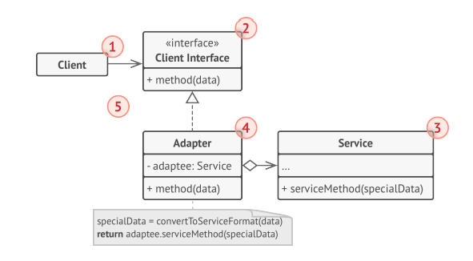
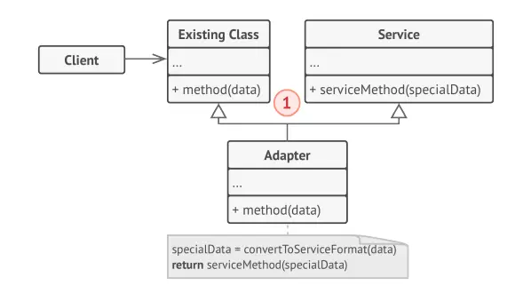

## CONCEPT

- Thuộc nhóm Structural
- Chuyển đổi khuôn mẫu (interface) của một lớp thành một khuôn mẫu khác mà phía clients muốn. Cho phép 2 khuôn mẫu không
  liên quan làm việc cùng nhau.
> VD: đang làm việc với 1 thư viện json và muốn thêm xml thì cần 1 khuôn mẫu bọc xml và cung cấp các chức năng giống như
> của json

## PURPOSE

## ARCHITECTURE

- `Adapter` có một interface tổng khái quát các chức năng cần làm và tương thích với object mà nó wrapper
- Việc sử dụng interface này, client hiện có có thể gọi các phương thức của Adapter một cách an toàn.
- Khi được gọi, Adapter sẽ chuyển yêu cầu đến object wrapper, nhưng theo một định dạng và thứ tự mà object wrapper mong
  đợi.

- Có 2 loại adapter:
  + class Adapter: sử dụng Inheritance (kế thừa) để kết nối Adapter và Adaptee
  + object Adapter: sử dụng Composition (chứa trong) để kết nối Adapter và Adaptee.

#### OBJECT ADAPTER - COMPOSITION

- `Client` là một class chứa business logic của chương trình
- `Client interface` mô tả một giao thức mà các lớp khác phải tuân theo để có thể collab với client code
- `Service`: là một class hữu ích (thường là bên thứ 3 hoặc kế thừa). Client không thể sử dụng trực tiếp lớp này vì nó
  có interface không tương thích.
- `Adapter`: là một class có thể hoạt động với cả client và service: nó implements client interface, trong khi đóng gói
  service object. Adapter khi được gọi từ Client thông qua Adapter Interface sẽ chuyển chúng thành các cuộc gọi service
  object được bao bọc ở định dạng mà nó có thể hiểu được.

#### CLASS ADAPTER - INHERITANCE

- `Class Adapter`: không cần phải bọc bất kỳ object nào vì nó kế thừa các hành vi từ client và service. 
- Adaptation xảy ra trong các phương thức bị ghi đè. 
- Kết quả của Adapter có thể được sử dụng thay cho một client class hiện có

#### COMPARE

- Class Adapter sử dụng Inheritance (kế thừa) để kết nối Adapter và Adaptee trong khi Object Adapter sử dụng
  Composition (chứa trong)
- Với Class Adapter, nếu một Adaptee là một class và không phải là một interface thì Adapter sẽ là một
  lớp con của Adaptee. Nó sẽ không phục vụ tất cả các lớp con khác theo cùng một cách vì Adapter là một lớp phụ
  cụ thể của Adaptee.
- Object Adapter sẽ tốt hơn vì nó sử dụng Composition để giữ một thể hiện của Adaptee, cho phép một Adapter hoạt động
  với nhiều Adaptee nếu cần thiết.

## BENEFIT

### PROS

- Tuân thủ SRP(Single Responsibility)
- Tuân thủ OCP(Open/Closed)

### CONS

- Code phức tạp với người không hiểu rõ

## USE WHEN

- Muốn sử dụng 1 class có sẵn nhưng không tương thích với code hiện tại
- Muốn sử dụng lại 1 số subclass hiện có và thiếu 1 số chức năng mà không thể thêm vào super class Adapter