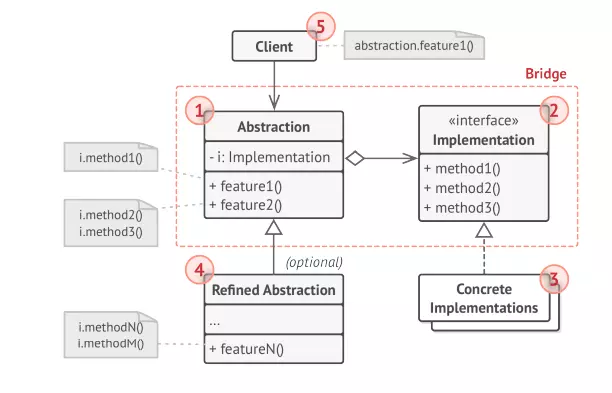
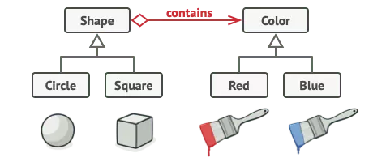

## CONCEPT

- Thuộc nhóm Structural
- Ý tưởng là tách abstract ra khỏi implementation của nó, dễ dàng chỉnh sửa hoặc thay thế mà không làm ảnh hưởng đến nơi
  sử dụng ban đầu

## PURPOSE

- Khi bạn muốn tách ràng buộc giữa `Abstraction` và `Implementation`, để có thể dễ dàng mở rộng độc lập nhau.
- Cả Abstraction và Implementation của chúng nên được mở rộng bằng subs class.
- Sử dụng ở những nơi mà những thay đổi được thực hiện trong implement không ảnh hưởng đến phía client.

## ARCHITECTURE

- `Abstraction` (Shape): định nghĩa giao diện của lớp trừu tượng, quản lý việc tham chiếu đến đối tượng hiện thực cụ
  thể (Implementation).
- `Refined Abstraction` (Circle, Square): kế thừa Abstraction.
- `Implementation` (Color): định nghĩa giao diện cho các lớp hiện thực. Thông thường nó là interface định ra các tác vụ
  nào đó của Abstraction.
- `ConcreteImplementation` (Red, Blue): kế thừa Implementation và định nghĩa chi tiết hàm thực thi.

## BENEFIT

### PROS

- Giảm sự phục thuộc giữa abstraction và implementation. Có thể được dùng để cắt đứt sự phụ thuộc này và cho phép chúng
  ta chọn implementation phù hợp lúc runtime.

- Giảm số lượng những lớp con không cần thiết
- Dễ bảo trì và mở rộng về sau
- Cho phép ẩn các chi tiết implement từ client: do abstraction và implementation hoàn toàn độc lập nên chúng ta có thể
  thay đổi một thành phần mà không ảnh hưởng đến phía Client. Ví dụ, các lớp của chương trình view ảnh sẽ độc lập với
  thuật toán vẽ ảnh trong các implementation. Như vậy ta có thể update chương trình xem ảnh khi có một thuật toán vẽ ảnh
  mới mà không cần phải sửa đổi nhiều.

### CONS

- Phức tạp, tăng độ gắn kết giữa các đối tượng

## USE WHEN

- Khi muốn tách ràng buộc giữa Abstraction và Implementation, để có thể dễ dàng mở rộng độc lập nhau.
- Khi cả Abstraction và Implementation của chúng nên được mở rộng bằng subclass.
- Thay đổi trong thành phần được bổ sung thêm của một Abstraction mà không ảnh hưởng đối với các Client

## EXAMPLE

- Ví dụ: có 2 đối tượng bàn và ghế, và có 2 triển khai chất liệu là gỗ và nhựa, thay vì tạo ra 4 đối tượng thì ta có thể
  tạo ra 2 đối tượng và áp dụng bridge