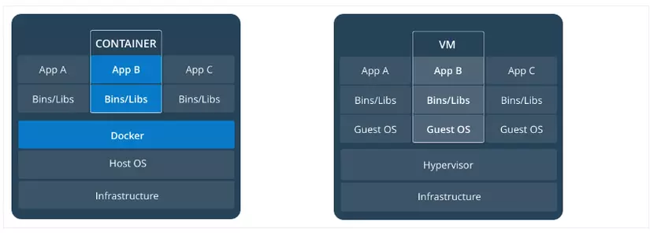

# Docker

## concept

* Là tập hợp của Platform as a service
* Là một nền tảng cho developers và sysadmin để develop, deploy và run application với container.
* Cho phép tạo các môi trường độc lập và tách biệt để khởi chạy và phát triển ứng dụng và môi trường này được gọi là **container**.
    ````
    - các container dùng chung kernel với OS
    -> sử dụng ít tài nguyên hơn máy ảo thông thường
    mối container sẽ thêm thắt 1 vài software -> thành ubuntu, centos, window, ...
    - máy ảo sẽ ảo hóa cả OS còn docker chỉ ảo hóa phần software
    ````
* Khi cần _deploy_ lên bất kỳ server nào chỉ cần `run container` của **Docker** thì application của bạn sẽ được khởi
  chạy ngay lập tức.
* Một số khái niệm cơ bản:
    - `Container`: Tương tự như một máy ảo, xuất hiện khi mình khởi chạy image. Tốc độ khởi chạy container nhanh hơn tốc
      độ khởi chạy máy ảo rất nhiều và bạn có thể thoải mái chạy 4,5 container mà không sợ treo máy. Các files và
      settings được sử dụng trong container được lưu, sử dụng lại, gọi chung là images của docker.

    - `Image`: là một file mẫu chỉ đọc (read-only) hướng dẫn việc tạo ra container. Tương tự như file .gho để ghost win
      mà
      mấy ông cài win dạo hay dùng. Image này không phải là một file vật
      lý mà nó chỉ được chứa trong Docker. Một image bao gồm hệ điều hành (Windows, CentOS, Ubuntu, …) và các môi trường
      lập trình được cài sẵn (httpd, mysqld, nginx, python, git, …).

        + image sử dụng cơ chế layer, mỗi image được cấu thành từ rất nhiều layer
        + `layer` là những file sinh ra từ các câu lệnh

    - `Docker Daemon`: là server Docker cho yêu cầu từ Docker API. Nó quản lý images, containers, networks và volume.
    - `Docker Volumes`: là tạo ra 1 cầu nối mount thư mục bên trong container ra 1 thư mục của host
      > nếu không dùng volumes thì các containers sẽ bị mất dữ liệu nếu stop
    - `Docker Networking`: cho phép kết nối các container lại với nhau. Kết nối này có thể trên 1 host hoặc nhiều host.
    - `Docker Compose`: là công cụ cho phép run app với nhiều Docker containers 1 cách dễ dàng hơn.
      > có thể build các container từ các image có sẵn hoặc build image trong file docker-compose luôn <br/>
        ta có `build.context` để xác định `file chứa dockerfile` và `build.dockerfile` để xác định tên `dockerfile`<br>
      > docker-compose up -d <name-image> để chạy ngầm với terminal <br>
      > depends_on dùng để gắn phụ thuộc vd containerA depends_on containerB thì containerB phải chạy trước containerA

    - `Dockerfile`: là tệp config dùng để build `image` sau đó `run container`:

    - `Docker Swarm`: là một công cụ quản lý **container orchestration** của Docker cho phép quản lý một cụm các máy chủ
      Docker (**_giống Kubernetes nhưng quy mô nhỏ hơn_**)

      ````
           Được xây dựng trên top của Docker Engine, vì vậy nó sử dụng các lệnh và cấu trúc tương tự như Docker.
      ````

    - `Docker Services`: là các containers trong production. 1 service chỉ run 1 image nhưng nó mã hoá cách thức để run
      image — sử dụng port nào, bao nhiêu bản sao container run để service có hiệu năng cần thiết và ngay lập tức 
      (**_một phần của docker swarm_**)
      

## advantage

* không như máy ảo, `start` và `stop` app rất nhanh
* `build` cũng nhanh hơn máy ảo
* Dễ dàng config môi trường với 1 file config, không cần phải cài đặt lại các phụ thuộc(dependencies)

        với 1 file config thì ở bất cứ đâu cũng đều dễ dàng setup môi trường mà không lo là có tương thích hay không

* giảm sự phụ thuộc môi trường giữa các app, mỗi app 1 môi trường config riêng, không bị ảnh hưởng đến nhau

        Giúp triển khai ứng dụng mà không phải phụ thuộc vào môi trường, bởi vì đơn giản, môi trường mà chúng ta triển khai nó nằm trong các container, 
        được dựng lên bởi các image, nhờ có các image đó mà chúng ta có thể tạo ra được bất kỳ container nào có setup môi trường như ý muốn tại bất cứ đâu.



## concept build layer docker image

* docker build image dựa trên cơ chế layers xếp chồng lên nhau
* mỗi 1 command trong docker file tương ứng với 1 layer
* nếu câu lệnh trước đó đã được thực thi và tạo layer thì Docker sẽ sử dụng layer cũ đó chứ không tạo layer mới nữa
* khi build cùng 1 dockerfile và cùng 1 câu lệnh build thì image mới sẽ dựa trên image cũ để tạo ra các layer mới, chứ không re-build
    > ta có thể giải nén file nén để docker chỉ build các file thay đổi
    > using cache trong lúc build tức là layer mới đang sử dụng lại layer cũ để build
    > những layer <none> là những layer không có tên còn được gọi là dangling image nó không trỏ đến layer nào cả
* Ta có thể nói 1 layer cũng đuợc coi là image nếu nó là layer cuối cùng ;)


## command

````
docker run --name tuanpl -it ubuntu-nginx:latest /bin/bash
````

- Option --name cho phép bạn đặt tên container.
- Option -t cung cấp một giao diện để gõ command bên trong container, còn -i cung cấp một " con đường" giúp cho các
  chương trình bên trong container nhận được những command đã viết.
- Túm váy lại là khi bạn viết option -it và /bin/bash thì docker sẽ run image đó thành một container và cho phép bạn
  truy cập vào shell bash của container đó thay vì thoát ra bash của máy host. 😅
---

````
docker exec -d tuanpl touch /tmp/execWorks
````

- docker exec dùng để chạy các lệnh bên trong 1 container
- 
---

- run : run một image

- start: start một container

- run : tạo một container từ image có sẵn, và thực thi nó

- start : chạy một container đã stop

Có thể hiểu một cách đơn giản, đó là run = create container + start container . 😄

---

````
docker volume create --name myvolume -d local -o o=bind -o type=none -o device=/data
````
ta sẽ tạo được 1 volume với thư mục /data