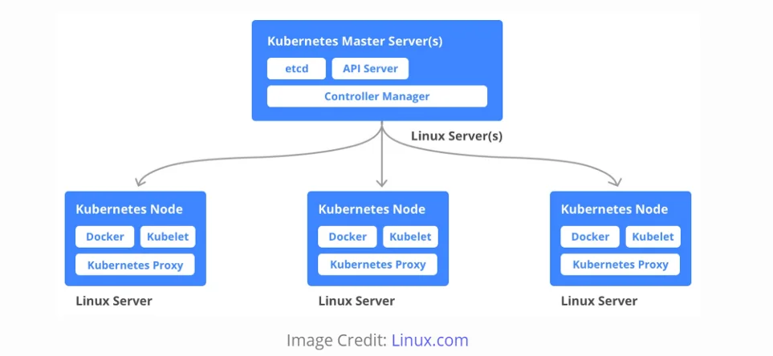
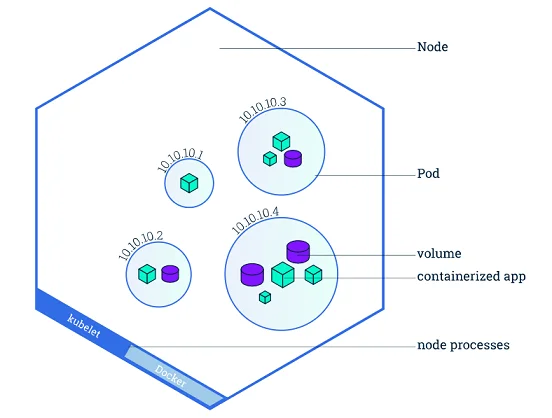

# Kubernetes

## concept

* Là một công cụ quản lý **container orchestration** của Docker cho phép quản lý một cụm các máy chủ Docker được phát
  triển bởi google
* Sử dụng kiến trúc master-slave

    1. Master Node: Là trung tâm điều khiển của cụm Kubernetes và quản lý các hoạt động của các node khác trong cụm.
       Master node bao gồm các thành phần sau:

        - API Server: Là thành phần chính của master node, cung cấp API để quản lý các tài nguyên trong cụm Kubernetes.
        - Etcd: Là một cơ sở dữ liệu phân tán được sử dụng để lưu trữ thông tin cấu hình của cụm.
        - Controller Manager: Là thành phần đảm bảo rằng trạng thái của các tài nguyên trong cụm luôn đúng và được duy
          trì.
        - Scheduler: Là thành phần đảm bảo rằng các container được triển khai đúng cách và trên các node phù hợp.

    2. Worker Node: Là các máy chủ thực hiện các container và cung cấp tài nguyên cho chúng. Mỗi worker node chứa một
       agent gọi là kubelet, một kubeproxy và một container runtime (như Docker).

    ````
    Khi triển khai một ứng dụng trên Kubernetes, ta sử dụng API của master node để tạo các đối tượng như pods, deployments và services. 
    Master node sẽ xử lý các yêu cầu này và phân phối các container tương ứng trên các worker node. Khi các container đang chạy trên worker node, 
    kubelet sẽ giám sát và báo cáo trạng thái của chúng cho master node. Kubelet cũng đảm bảo rằng các container được triển khai đúng cách và có thể tự phục hồi khi có lỗi xảy ra. 
    Kubeproxy giám sát các dịch vụ và cập nhật bảng định tuyến để đảm bảo rằng các yêu cầu được định tuyến đúng cách.
    ````
    ````
    Ta có server Master, mỗi hệ thống có thể có nhiều Node. Node tương ứng với một host. 
    Mỗi Node lại có thể bao gồm rất nhiều Pod. Mỗi Pod lại chứa nhiều container (có thể không phải Docker container). 
    Và cuối cùng là Kubernetes sẽ quản lý lifecycle của các Node, Pod, thêm bớt, monitor,… nói chung là giúp hệ thống hoạt động ổn định.
    ````
  
---

### Pods

Khi bạn triển khai ứng dụng thông qua Module, Kubernetes tạo ra Pod để lưu trữ phiên bản chạy của ứng dụng của bạn.
Một Pod là một khái niệm trừu tượng của Kubernetes, đại diện cho một nhóm gồm một hoặc nhiều ứng dụng containers (ví dụ
như Docker hoặc rkt) và một số tài nguyên được chia sẻ cho các containers đó. Những tài nguyên đó bao gồm:

- Lưu trữ được chia sẻ, dưới dạng Volumes
- Kết nối mạng, như một cluster IP duy nhất
- Thông tin về cách chạy từng container, chẳng hạn như phiên bản container image hoặc các ports cụ thể để sử dụng

Một Pod mô phỏng một "máy chủ logic" dành riêng cho ứng dụng và có thể chứa các ứng dụng containers khác nhau được
liên kết tương đối chặt chẽ. Ví dụ, một Pod có thể bao gồm cả container với ứng dụng Node.js của bạn cũng như một
container khác cung cấp dữ liệu hiển thị bởi webserver của Node.js. Các containers trong một Pod chia sẻ một địa chỉ
IP và port space, chúng luôn được đặt cùng vị trí, cùng lên lịch trình, và chạy trong ngữ cảnh được chia sẻ trên cùng
một Node.

Pods là các đơn vị nguyên tử trên nền tảng Kubernetes. Khi chúng ta tạo một kịch bản triển khai (Deployment) trên
Kubernetes, kịch bản triển khai đó tạo ra các Pods với các containers bên trong chúng (trái ngược với việc tạo các
containers trực tiếp). Mỗi Pod được gắn với Node nơi nó được lên lịch trình, và tiếp tục ở đó cho đến khi chấm dứt (theo
chính sách khởi động lại). Trong trường hợp có lỗi ở Node, các Pods giống nhau được lên lịch trình trên các Nodes có sẵn
khác trong cluster.

---

### Nodes

Một Pod luôn chạy trên một Node. Một Node là một máy worker trong Kubernetes và có thể là máy ảo hoặc máy vật lý, tuỳ
thuộc vào cluster. Mỗi Node được quản lí bởi Master. Một Node có thể chứa nhiều Pods và Kubernetes master tự động xử lí
việc lên lịch trình các Pods thuộc các Nodes ở trong cluster. Việc lên lịch trình tự động của Master sẽ tính đến các tài
nguyên có sẵn trên mỗi Node.

Mỗi Node ở Kubernetes chạy ít nhất:

* Kubelet, một quy trình chịu trách nhiệm liên lạc giữa Kubernetes Master và Node; quản lí các Pods và các containers
  đang chạy trên cùng một máy.
* Một container runtime (như Docker, rkt) chịu trách nhiệm lấy container image từ registry, giải nén container và chạy
  ứng dụng. Các containers chỉ nên được lên lịch trình cùng nhau trong một Pod duy nhất nếu chúng được liên kết chặt
  chẽ.





