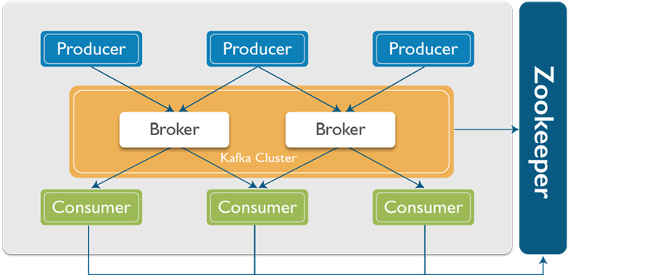
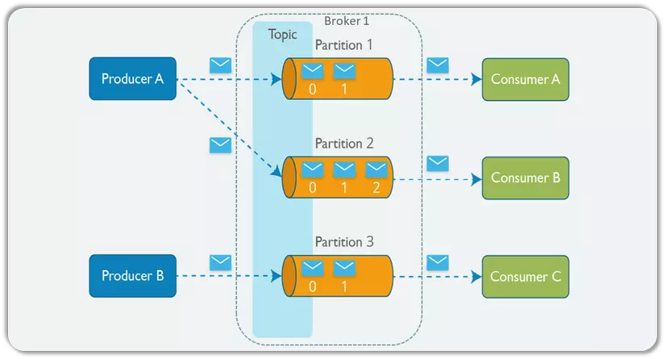

## CONCEPT  

- Là mã nguồn mở, đóng gói hoàn chỉnh, khả năng chịu lỗi cao
- Là hệ thống trung gian `phân phối stream`, `tách rời data pipeline` giữa các hệ thống

## PURPOSE

- Xây dựng các `pipeline stream` theo `real time `
  - để nhận data giữa các hệ thống hoặc các app 1 cách `đáng tin cậy`
  - để `biến đổi` hoặc `ánh xạ` đến các stream của data

## ARCHITECTURE

#### BASE

#### CONCRETE

- `Producer`: Một producer có thể là bất kì ứng dụng nào có chức năng `publish message` vào một `topic`.
- `Messages`: Messages đơn thuần là byte array và có thể sử dụng để lưu bất kì object với bất kì format
  nào - thông thường là String, JSON và Avro
- `Topic`: Một topic là một category hoặc feed name nơi mà record được publish.
- `Partitions`: Các topic được chia nhỏ vào các đoạn khác nhau, các đoạn này được gọi là partition
  - Mỗi `1 topic` sẽ được chia thành `nhiều partition` để xử lý có thể nói 1 partition là 1 stream
- `Consumer`: Một consumer có thể là bất kì ứng dụng nào có chức năng subscribe vào một topic và tiêu thụ messages.
- `Broker`: Kafka cluster là một set các server, mỗi một set này được gọi là 1 broker
  - Mỗi `1 topic `có thể có `chia cho nhiều broker` hay nói cách khác là `2 broker có thể có các partition của cùng 1 topic`
    - tăng tính sẵn sàng, khả năng scale mạnh
  - Mỗi 1 broker có thể có nhiều topic
- `Zookeeper`: được dùng để quản lý `Metadata` của cluster kafka và bố trí các broker.
  - Cung cấp API để cac producer và consumer có thể tương tác với các thành phần trong cluster
- `Metadata` trong Kafka là các thông tin về cấu trúc và trạng thái của các thành phần trong một cluster Kafka, bao gồm
  các broker, các topic, các partition và các consumer group. Metadata được quản lý bởi Apache ZooKeeper và được sử dụng
  để cho phép producer và consumer tương tác với các thành phần trong cluster.

> Các `Producer` và `Consumer` sẽ chỉ tương tác với nhau thông qua `Topic`  
> Các broker trong cụm Kafka hoạt động theo mô hình peer-to-peer, nghĩa là không có broker nào được ưu tiên hơn các broker khác. 
> Các broker trong một cụm Kafka là đồng bộ và phân chia công việc với nhau để xử lý các yêu cầu đọc/ghi dữ liệu từ producer và consumer.

- sau khi consumer `nhận message` thì nó có 2 kiểu ack
  + `auto-ack`: consumer tự động gửi ack đến kafka sau khi consumer nhận được message -> dễ bị mất hoặc xử lý trùng lặp
  + `manual-ack`: có thể ack tới kafka sau khi consumer hoàn thành xử lý xong message -> kiểm soát message nhưng không tối ưu
- sau khi consumer `xử lý message fail` thì sẽ xảy ra 2 case:
  + `retry`: khi 1 message fail thì consumer sẽ thử xử lý lại message đó nhiều lần, có thể config số lần retry
  + `dead letter queue`: là 1 topic riêng để lưu trữ các message không được xử lý sau nhiều lần retry, có thể xử lý lại hoặc phân tích lỗi  
- `replica` là một bản sao của các partition trong một topic được lưu trữ trên các broker khác nhau trong cùng một cụm Kafka.
  + đảm bảo tính sẵn sàng, tin cậy của dữ liệu
  + các producer và consumer chỉ làm việc với leader replica chứ không làm việc với follower replica
  + peplica phụ sẽ gửi yêu cầu đồng bộ hóa (sync request) đến replica chủ và replica chủ sẽ trả về dữ liệu mới nhất, là quá trình tự động và liên tục

  > - Khi một message được gửi đến Kafka, nó sẽ được ghi vào một partition trong một topic. Mỗi partition trong Kafka có
  thể có nhiều replica, và mặc định là có ít nhất hai replica cho mỗi partition. Các replica được phân tán trên các
  broker khác nhau trong cùng một cụm Kafka. 
  > - Khi một broker chịu trách nhiệm cho một partition (gọi là `leader replica`), các replica khác của partition đó (gọi là
  `follower replica`) sẽ sao chép dữ liệu từ `leader replica`. Khi leader replica nhận được một message mới, nó sẽ sao chép
  message đó sang các follower replica. Sau khi các `follower replica` đã sao chép message mới nhất từ leader replica, nó
  sẽ gửi ACK (acknowledgement) đến leader replica để xác nhận rằng nó đã sao chép thành công message đó. Nếu leader
  replica nhận được ACK từ tất cả các follower replica, nó sẽ gửi ACK cho producer để xác nhận rằng message đã được ghi
  thành công. 
  > - Nếu leader replica bị lỗi, Kafka sẽ tự động chuyển đổi một trong các follower replica trở thành leader replica mới.
  Quá trình này được gọi là quá trình leader election. Khi một follower replica được chuyển đổi thành leader replica,
  các replica khác sẽ sao chép dữ liệu từ leader replica mới này.

###### offset trong partition

Trong Kafka, offset là một số nguyên duy nhất đại diện cho vị trí của một message trong một partition của một topic.
Offset bắt đầu từ 0 và tăng lên mỗi khi một message mới được ghi vào partition. Vì vậy, mỗi message trong một partition
của một topic sẽ có một offset riêng biệt.

Khi consumer trong Kafka đọc các message từ một partition của một topic, nó sẽ đọc các message từ offset hiện tại đến
offset mới nhất của partition đó (được gọi là "end offset"). Khi consumer đã đọc các message từ offset hiện tại đến end
offset, nó sẽ gửi một ACK (acknowledgement) tới Kafka để đánh dấu rằng nó đã đọc các message đó thành công. Offset hiện
tại của consumer sẽ tăng lên bằng với end offset sau khi đã gửi ACK đó.

Khi consumer khởi động lần đầu tiên, offset hiện tại của nó sẽ được cấu hình để bắt đầu từ đầu partition (offset 0) hoặc
từ offset mới nhất củapartition (end offset). Nếu consumer đã đọc các message từ offset hiện tại đến end offset và đã
gửi ACK đến Kafka, sau đó consumer bị tắt hoặc khởi động lại, offset hiện tại của nó sẽ được lưu trữ trong Kafka để tiếp
tục đọc các message tiếp theo từ offset đó. Điều này đảm bảo rằng consumer không bỏ lỡ bất kỳ message nào trong Kafka.

- Có hai loại offset trong Kafka: committed offset và current offset.

  - Committed offset là offset cuối cùng mà consumer đã gửi ACK tới Kafka. Committed offset được lưu trữ trong một topic
   đặc biệt có tên là "__consumer_offsets". Kafka sẽ sử dụng committed offset để đảm bảo rằng các message không được đọc
   lại khi consumer khởi động lại hoặc khi consumer mới tham gia vào một consumer group.

  - Current offset là offset hiện tại mà consumer đang đọc từ partition. Current offset có thể thay đổi trong quá trình
    consumer đọc các message mới nhất từ partition. Nếu consumer đã đọc các message mới nhất từpartition và đã gửi ACK tới
    Kafka, current offset sẽ được cập nhật để bắt đầu đọc các message tiếp theo từ offset đó.

- Có 3 loại ACK:
  - `acks=0 (no acks)`: Trong trường hợp này, producer sẽ không đợi bất kỳ ACK nào từ broker và cho rằng message đã được
    gửi thành công sau khi đã ghi vào socket. Điều này dẫn đến rủi ro mất dữ liệu nếu broker không nhận được message.
  - `acks=1 (leader ack)`: Trong trường hợp này, khi một message được gửi đến Kafka, producer sẽ đợi ACK từ leader replica
    của partition. Nếu leader replica nhận được message và ghi thành công, nó sẽ gửi ACK cho producer. Sau khi producer
    nhận được ACK từ leader replica, nó sẽ cho rằng message đã được gửi thành công. Tuy nhiên, nếu leader replica bị lỗi
    trước khi message được sao chép sang các follower replica, message đó có thể bị mất.
  - `acks=all (all acks)`: Trong trường hợp này, khi một message được gửi đến Kafka, producer sẽ đợi ACK từ tất cả các
    replica của partition. Khi một message được gửi đến Kafka, leader replica sẽ sao chép message đó sang các follower
    replica và đợi ACK từ tất cả các follower replica. Nếu tất cả các follower replica nhận được message và ghi thành
    công, chúng sẽ gửi ACK cho leader replica. Khi leader replica nhận được ACK từ tất cả các follower replica, nó sẽ
    gửi ACK cho producer để xác nhận rằng message đã được ghi thành công.

## SPRING KAFKA

- có thể tạo nhiều MessageConverter nhưng phải có độ ưu tiên