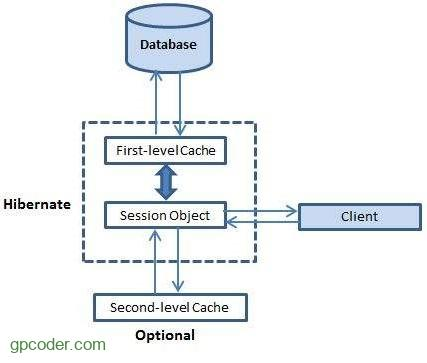

## CONCEPT

- là bộ nhớ đệm lưu trữ dữ liệu trong phiên làm việc(session) của application
- lưu trữ và không phải truy cập CSDL thường xuyên của ORM Framework
- có khả năng lưu chữ các entity và cả các entity Graph

## LEVEL

#### `First-level Cache – L1 Cache` (Bộ nhớ cache cấp một) : bộ nhớ cache ở mức Session.
- là bộ nhớ cached bắt buộc vào không thể disable
- lưu trữ ở session trước khi commit vào database
- chỉ có phạm vi trong 1 session

#### `Second-level Cache – L2 Cache` (Bộ nhớ cache cấp hai) : bộ nhớ cache ở mức Session Factory.

- Là bộ nhớ cached tùy chọn không bắt buộc, default là disable
- phạm vi trong sessionFactory
- cung cấp 1 interface org.hibernate.cache.CacheProvider để bên thứ 3 có thể triển khai

* Setup:
  * định nghĩa cache concurrency strategy
  * cấu hình cho các attribute cho cache expiration và cache vật lý bằng cách sử dụng cache provider

##### cache concurrency strategy:

- là bộ điều chỉnh có trách nhiệm lưu trữ các mục dữ liệu trong bộ nhớ cache và lấy chúng từ bộ nhớ cache.
- Nếu muốn kích hoạt cache L2 thì phải có `cache strategy` và `cache provider`
- STRATEGY:
  - `READ_ONLY`: sử dụng cho các đối tượng liên tục, luôn đọc và không bao giờ cập nhật, là chiến lược đơn giản và hiệu suất tốt nhất
  - `NONSTRICT_READ_WRITE`: không đảm bảo tính nhất quán giữa DB và cache, sử dụng khi dữ liệu hầu như không thay đổi, có đổi cũng không quan trọng
  - `READ_WRITE`: đảm bảo tính nhất quán bằng việc dùng cơ chế soft lock. Khi một Entity đã cache bị update, một soft lock
    được lưu lại trong cache cho entity và nó sẽ được giải phóng (release) khi transaction được commit. Tất cả các
    transaction nếu truy cập vào các đối tượng đang bị soft block sẽ được lấy trực tiếp từ cơ sở dữ liệu. phù hợp cho
    các đối tượng liên tục có thể được cập nhật bởi ứng dụng Hibernate. Tuy nhiên, nếu dữ liệu được cập nhật thông qua
    backend hoặc các application khác, thì không có cách nào Hibernate biết về nó và dữ liệu có thể bị cũ. Vì vậy, trong
    khi sử dụng chiến lược này, hãy đảm bảo bạn đang sử dụng API Hibernate để cập nhật dữ liệu.
  - `TRANSACTIONAL`: cung cấp 1 bộ đệm transaction đầy đủ, một thay đổi trong Entity được lưu trong bộ nhớ cache được
    được đảm bảo khôi phục trong cả cơ sở dữ liệu và bộ đệm trong cùng một transaction.

- PROVIDER: 1 số provider thông dụng gồm có Jboss cache, Swarm cache, EH cache
- Lựa chọn strategy phù hợp với mỗi provider để chúng tương thích với nhau
- Cách thức hoạt động:
  - đầu tiên sẽ tìm ở L1 cache không thấy sẽ đến L2, sau đó sẽ lại lưu ở L1 và sau sẽ load ở L1 chứ không phải L2
  - nếu không tìm thấy trong L2 thì câu query sẽ thực thi và sẽ được lưu cả ở L1 và L2
  - collections mặc định sẽ không được cache lại 
- Cấu hình chính sách hết hạn cho bộ nhớ cache thông qua provider

#### `Query Cache` (Bộ nhớ cache cấp truy vấn) : cache các kết quả truy vấn kết hợp chặt chẽ với L2 Cache.

