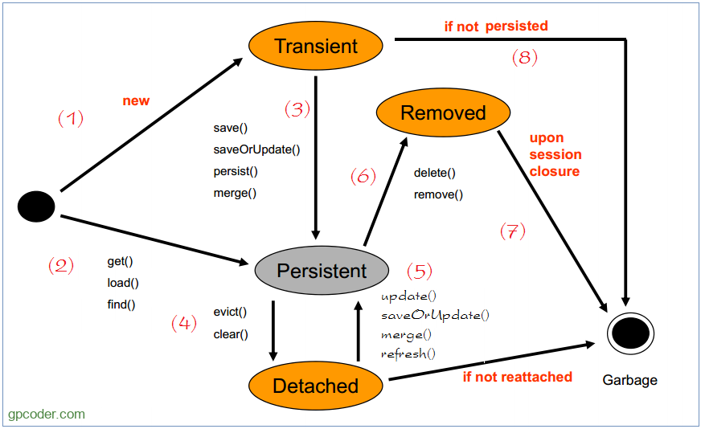

## CONCEPT

- JPA (Java Persistence API) là 1 đặc tả(bản thiết kế) java cho việc ánh xạ giữa các đối tượng java với CSDL quan hệ
- ORM (Object Relational Mapping) là những triển khai(Implement) của JPA
- Hibernate là 1 ORM (Object Relational Mapping) framework
- Hibernate giải quyết vấn đề giữa mô hình quan hệ và hướng đối tượng bao gồm (chi tiết, thừa kế, định danh, quan hệ)

#### SessionFactory:

- là 1 triền khai từ EntityManagerFactory của hibernate
- là interface tạo ra session kết nối đến DB bằng cách đọc cấu hình trong Hibernate config(Datasource)
- mỗi 1 datasource sẽ tương ứng với 1 SessionFactory

#### Hibernate session

- Một session được sử dụng để có được 1 kế nối vật lý với DB
- Mỗi session được sessionFactory tạo ra để kết nối
- Bên trong Hibernate Session chứa một java.sql.Connection JDBC, cung cấp các transaction cho mỗi phiên session.

#### Transaction

- Đại diện cho 1 đơn vị làm việc với DB
- Đảm bảo tính toàn vẹn của phiên làm việc với DB
- `LazyInitializationException`: là lỗi xảy ra khi ta cố truy cập vào 1 lazy entity khi mà session đã bị đóng

## BENEFIT

- Mã nguồn mở, nhẹ, hiệu suất nhanh nhờ có bộ nhớ cache
- Truy vấn độc lập nhờ HQL mọi loại sql đều được generate từ HQL
- Tạo bảng tự động
- Đơn giản hóa các câu lệnh join

## KEY

- `Persistence object`: là các POJO object map với các table tương ứng trong database
- `Configuration`: là đối tượng cấu hình hibernate

## LIFECYCLE

- 1 trạng thái của object(entity) sẽ chịu sự quản lý của session. Session được coi là 1 persistence context
- `Persistence context` có thể coi là một `môi trường` chứa toàn bộ các đối tượng mà ta tạo ra và lưu vào csdl trong mỗi
  session.
- Một Session là một giao dịch, có phạm vi tùy vào từng ứng dụng. Ta làm việc với DB thông qua một Persistence Context

### Entity status

- `Transient` (Tạm thời): Đối tượng không có quan hệ với Session hiện tại của Hibernate. Đối tượng ở trạng thái này
  chưa từng gắn vào context, nó không có bản ghi tương ứng trong CSDL
- `Persistent` (Bền vững): Đối tượng đang liên hệ với một context, tức là với một đối tượng Session và trạng thái của nó
  được đồng bộ với cơ sở dữ liệu khi mà ta commit cái Session.
- `Detached` (Đã bị tách riêng ra): Đối tượng đã từng có trạng thái persistent nhưng hiện tại đã không còn giữ quan hệ
  với Session. Nếu nó không được attached trở lại, nó sẽ bị bộ gom rác của Java quét đi theo cơ chế thông thường. Một
  đối tượng đang trong session muốn đạt đươc trạng thái này thì có những cách là gọi hàm evict(), close Session hoặc làm
  combo thao tác: serialize/deserialize.
- `Removed` (Đã bị xóa): tương tự như detached nhưng bản ghi tương ứng với đối tượng này trước đó đã bị xóa khỏi
  database.

- (1) Transient: Trường hợp bạn tạo mới một đối tượng java từ một Entity, đối tượng đó có tình trạng là Transient.
  Hibernate không biết về sự tồn tại của nó. Nó nằm ngoài sự quản lý của Hibernate.
- (2) Persistent: Trường hợp bạn lấy ra đối tượng Entity bằng method get, load hoặc find, bạn có được một đối tượng nó
  tương ứng với 1 record dưới database. Đối tượng này có trạng thái Persistent. Nó được quản lý bởi Hibernate. Khi đối
  tượng ở trạng thái persistent, tất cả các thay đổi mà bạn thực hiện đối với đối tượng này sẽ được áp dụng cho các bản
  ghi và các trường cơ sở dữ liệu tương ứng khi flush session.
- (3) Transient -> Persistent: Session gọi một trong các method save, saveOrUpdate, persist, merge sẽ đẩy đối tượng
  Transient vào sự quản lý của Hibernate và đối tượng này chuyển sang trạng thái Persistent. Tùy tình huống nó sẽ insert
  hoặc update dữ liệu vào DB.
- (4) Persistent -> Detached: Session gọi evict(..) hoặc clear() để đuổi các đối tượng có trạng thái persistent (bền
  vững)ra khỏi sự quản lý của Hibernate, giờ các đối tượng này sẽ có trạng thái mới là Detached (Bị tách ra). Nếu nó
  không
  được đính (Attached) trở lại, nó sẽ bị bộ gom rác của Java quét đi theo cơ chế thông thường.
- (5) Detached -> Persistent: Sử dụng update(..), saveOrUpdate(..), merge(..) sẽ đính trở lại các đối tượng Detached vào
  lại. Tùy tình huống nó sẽ tạo ra dưới DB câu lệnh update hoặc insert. Các đối tượng sẽ trở về trạng thái Persistent (
  bền vững).
- (6) Persistent -> Removed: Session gọi method remove(..), delete(..) để xóa một bản ghi, đối tượng persistent giờ
  chuyển sang trạng thái Removed (Đã bị xóa).

## TIP

- Việc thực thi câu lệnh SQL thực tế vào cơ sở dữ liệu xảy ra khi commit transaction hoặc flush session.
- hibernate không có save all mà nó chỉ loop list entity và save thôi
- nếu không có yêu cầu đặc biệt nào thì ta nên tuân thủ theo 2 phương thức của JPA là persist() và merge()

## Hibernate DDL auto

- `create` : Nếu giá trị này được sử dụng, Hibernate sẽ xóa tất cả các table và structure. Sau đó, tạo lại các table mới
  dựa vào Hibernate Entity. Lưu ý khi sử dụng giá trị này, các dữ liệu của chúng ta sẽ bị mất và không thể phục hồi lại
  được.
- `validate` : Nếu giá trị này được sử dụng, Hibernate chỉ validate các table structure ở đó các table và column tồn tại
  hay không. Nếu table không tồn tại, Hibernate sẽ throw một Exception.
- `update` : Nếu giá trị này được sử dụng, Hibernate sẽ kiểm tra table tồn tại hay không. Nếu không tồn tại, table mới
  sẽ được tạo. Tương tự với column, nếu column không tồn tại, Hibernate sẽ tạo một column mới. Với giá trị update này,
  các table sẽ không được xóa nên dữ liệu của chúng ta không bị mất.
- `create-drop` : Nếu giá trị này được sử dụng, Hibernate sẽ tạo các table structure để thực hiện các thao tác và các
  table structure sẽ được xóa sau khi các thao tác đã hoàn thành (SessionFactory đã đóng). Giá trị này thích hợp khi
  viết Unit test cho Hibernate code.

## Sự khác nhau giữa commit() và flush()

- flush: là đồng bộ dữ liệu xuống db nhưng chưa commit tựa như execute nhưng chưa commit trong db vậy
- commit: là đồng bộ dữ liệu và commit luôn

## Problem

- N+1 problem: là vấn đề khi hibernate truy vấn 1 câu query nhưng lại kéo theo N cấu query gây ảnh hưởng performance